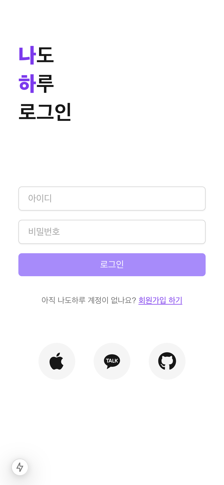
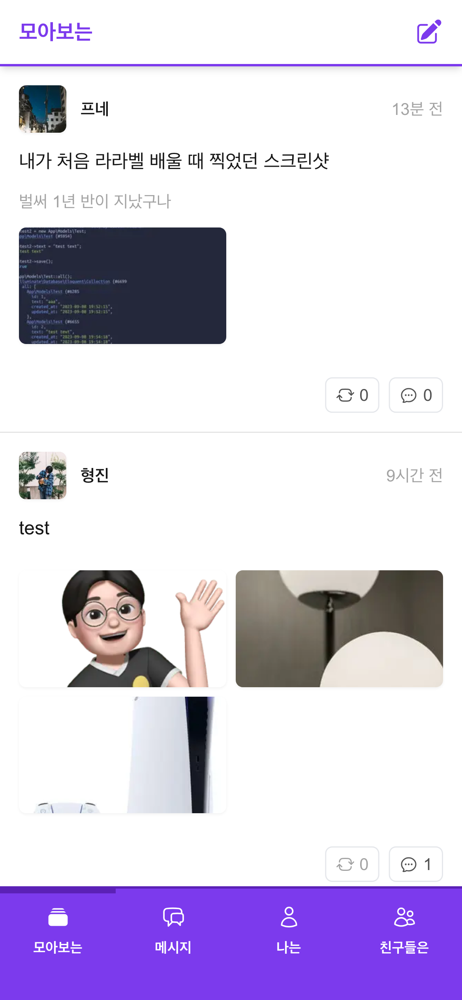
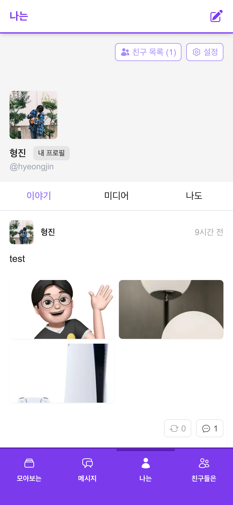

  

<h1 align="center">
  나도하루 웹버전 (in development 👨‍🔧)
</h1>

  
  
  
  

## 🫧 Introductions

Next.js standalone version of NDHR Project. NDHR is the social network micro blog service.

You can see an original project here: https://github.com/GuitarCoders/front

## 🔧 Stacks

- TypeScript
- Next.js
- Iron Session
- Tailwind CSS
- Prisma
- Vercel
- and so on..

## 🚀 Deploy

- Deploy with Vercel
